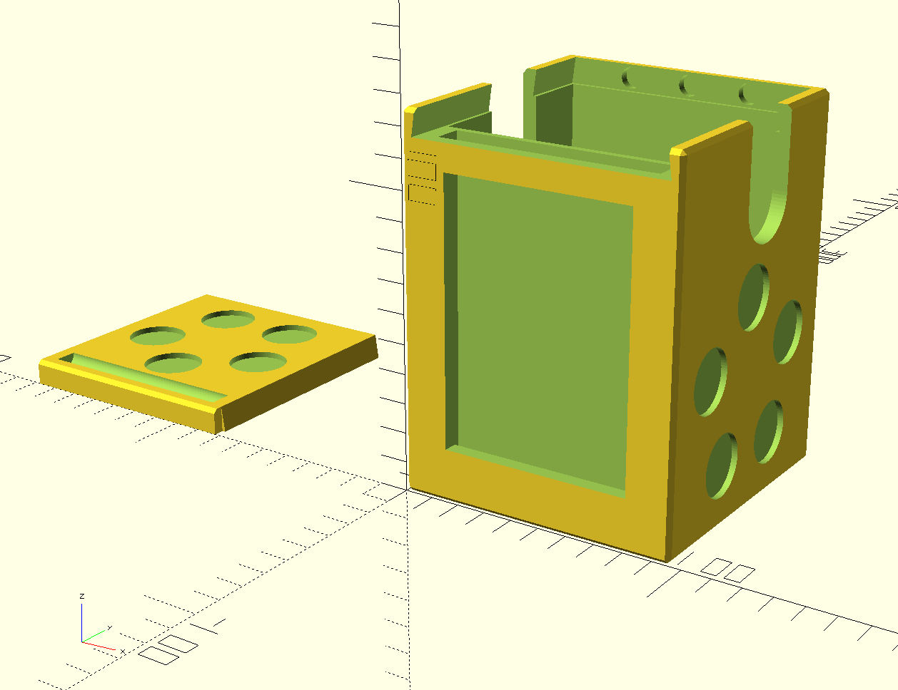

# DeckBoxGenerator

A fully customizable **TCG Deck Box Generator** for OpenSCAD.

Version == **1.1**

## Requirements

- OpenSCAD <http://www.openscad.org>
- The BOSL2 library <https://github.com/revarbat/BOSL2#installation>

## Introduction

Have you been looking through the various 3D Printed Deck boxes and just not found one that caters to your interests? Does every Commander Box you find just not support the oversized Top Loader you prefer to use? Are you frustrated with your small Board Game Cards just tumbling around every which way within the Game box? This OpenSCAD Script seeks to solve all those problems! This script was written using the BOSL2 Library and is Published under the BSD 2-Clause License, thus making it free and open source. It was primarily made for Magic The Gathering Cards, however the variables can be modified to pretty much fit any sized cards as long as you have the dimensions you need. There is also a high degree of customizability with this box generator allowing the four sides and the Lid to be customized with depressions for tokens or for a plate. Instructions on how to use and planned updates are below. The only thing requested is to freely distribute and show this to others as options for those who wish to 3D Print more. If you wish to contribute or have any comments or suggestions, please feel free to message DekoaRildin on GitHub. Finally, I KNOW my code can be better written! I know! I went with the logic first and I plan to optimize later ok?

## Licensing/Disclaimer

DeckBoxGenerator and the Included BOSL2 Library are licensed under the BSD 2-Clause License

## Planned Minor Version Improvements
- Build in box_lid_cut variable between 10% and 75% to adjust how much the lid cuts into the sides (Default: 25%)
- Able to Imprint Text onto sides and lid
- Able to add Glass Pain Slot for Commannder Slot
- Gridfinity base?
- Separate more Box Lid stuff in variables

## Planned Major Version Improvements
- Stackable Box/Lid Concept (Requires slop tolerance)
- Trinket/Die box Add On (Requires Stackable Box/Lid)
- Commander Slot in Lid Version (Requires Optimization)
- Command Slot able to be moved to the other Sides (Requires Optimization)
- Possible slot and clip for Lid in order to not need magnets?
- Add ability to imprint images/logos

## How to Use

This script will generate a TCG Deck Box based off of the dimensions provided within the configuration parameters. Size is primarily calculated per Inner Deck Box Measurements, Commander slot Measurements, Thickness of the Walls, and Lid. Caution and proper backups are encouraged if modifying the original OpenSCAD file. When utilizaing in the OpenSCAD Program itself, the parameters are listed in the Customizer window. It is recommended to make any modifications to your deck box here. The default parameters is set up to have a larger than normal commander slot along the lid being secured by a Dovetail method, 3 magnets help hold the lid in place, while each side has either simple coin depressions for decorations, or a plate depression for custom decoration as well. Please note that if parameters are non compliant (I.E. various components collide or are too big or too small), that the script's behavior will try and render it and may error out. Reset to Default parameters in order to start over. Each Variable and how they interact with the Script are listed below.

## Important Notes!!
- Deck Box Size is rendered based off IDB Parameters, Wall thickness, Commander Slot, and Lid Thickness.
- If IDB or Commander is Shorter in Z-Axis than the other, Z-Axis Size takes Larger of the two.
- Shorter Z-Axis Measurement between IDB or Commander will have Infil from the Bottom.
- Wall thickness between Commander and IDB is Half of the box_wall_thick parameter.
- Rounding/Clipping applies to Outer Box and Lid Only.
- Rounding will apply over Clipping if both are Selected.
- Side 1 is Y-Axis side closest to Origin.
- Side 2 is X-Axis side furthest from Origin.
- Side 3 is Y-Axis side furthest from Origin.
- Side 4 is X-Axis side closest to Origin.
- If Commander Display is needed for slot, Apply Plate to side 4 and use corresponding depth.

## Variable Descriptions

### What to Make
|Variable Name    |Description|
|---              |---        |
|`make_box`       |Renders the Deck Box. Deselect to prevent rendering.|
|`make_lid`       |Renders the Box Lid. Deselect to prevent rendering.|

### Inner Box Dimensions
|Variable Name    |Description|
|---              |---        |
|`idb_length_x`   |Inner Deck Box length in the X-Axis Direction. Required.|
|`idb_length_y`   |Inner Deck Box length in the Y-Axis Direction. Required.|
|`idb_length_z`   |Inner Deck Box length in the Z-Axis Direction. Required.|

### Shared Box and Lid Config
|Variable Name              |Description|
|---                        |---        |
|`box_lid_thick`            |Thickness of the Box's Lid. Required.|
|`box_lid_secure`           |Securing Method of the lid on X-Axis.|
|`box_lid_noback`           |If true, removes back wall for lid slot. Adjust's Lid as well.|
|`box_lid_magnet_amount`    |How many Magnet slots are in the Lid and Back Wall.|
|`box_lid_magnet_depth`     |Depth into the wall/Lid for the Magnets.|
|`box_lid_magnet_diameter`  |Diameter of the Magnet Slots.|
|`box_lid_lip`              |How much Box lid cuts into back wall. (NOT IMPLEMENTED)|
|`slop_tolerance`           |Defines how much Additional Tolerance for parts. Recesses add this amount, Additional parts subtract this amount.|

### Deck Box Config
|Variable Name              |Description|
|---                        |---        |
|`box_wall_thick`           |Thickness of the Walls of the Box. Required.|
|`box_commander_slot`       |Adds a commander slot. Wall between IDB and this is Half wall Thickness.|
|`box_cardgrab`             |Adds a Card Grab to Sides 1 and 3.|
|`box_cardgrab_width`       |Width of the Card Grab Slot.|
|`box_cardgrab_height`      |Depth of the Card Grab Slot.|

### Box Lid Config
|Variable Name                |Description|
|---                          |---        |
|`box_lid_divot_depth`        |Depth of the Lid Grab Divot. Set to 0 to Remove.|
|`box_lid_slot`               |Selection for Lid Feature.|
|`box_lid_coinslots_amount`   |If Coins selected, how many showing.|
|`box_lid_coinslots_depth`    |If Coins Selected, depth into lid.|
|`box_lid_coinslots_diameter` |If Coins Selected, Diameter of coins.|
|`box_lid_coinslots_rotate`   |If Coins Selected, Rotation in Degrees of where to render.|
|`box_lid_plateslot_width`    |If Plate Selected, Width of Plate Insert, X-Axis.|
|`box_lid_plateslot_height`   |If Plate Selected, Height of Plate Insert, Y-Axis.|
|`box_lid_plateslot_depth`    |If Plate Selected, Depth of Plate Insert into Lid, Z-Axis.|

### Commander Slot Config
|Variable Name        |Description|
|---                  |---        |
|`cmd_length_x`       |Commander length in the X-Axis Direction.|
|`cmd_length_y`       |Commander length in the Y-Axis Direction.|
|`cmd_length_z`       |Commander length in the Z-Axis Direction.|

### Rounding/Clipping
|Variable Name         |Description|
|---                   |---        |
|`edge_rounding`       |Rounds the Edges of the Deck box and Lid. Takes Priority.|
|`edge_clipping`       |Clips/Chamfer's the Deck box and Lid.|
|`trim_corners`        |If Selected, will trim corners as well.|

### Deck Box Sides Config
|Variable Name                    |Description|
|---                              |---        |
|`box_side(n)_slot`               |Selection for Side (n) Feature.|
|`box_side(n)_coinslots_amount`   |If Coins selected, how many showing.|
|`box_side(n)_coinslots_depth`    |If Coins Selected, depth into Side.|
|`box_side(n)_coinslots_diameter` |If Coins Selected, Diameter of coins.|
|`box_side(n)_coinslots_rotate`   |If Coins Selected, Rotation in Degrees of where to render.|
|`box_side(n)_plateslot_width`    |If Plate Selected, Width of Plate Insert.|
|`box_side(n)_plateslot_height`   |If Plate Selected, Height of Plate Insert.|
|`box_side(n)_plateslot_depth`    |If Plate Selected, Depth of Plate Insert into Side.|

##Change Log
### DeckBoxGenerator v1.1 == August, 2025
- Optimized script from 2500 lines to roughly 600
- Added Built in Slop Tolerance variable
- Added variable for back lid Lip, but not implemented yet.
### DeckBoxGenerator v1.0 == July, 2025
- Original Release